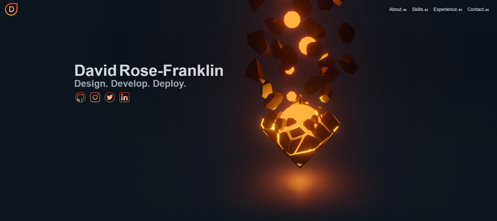

# My Portfolio



# Dependencies

- Three JS
- React Three Fiber/Drei
- Maath
- Framer Motion
- Intersection Observer
- Tailwindcss
- Next Core Libraries
- Mongoose
- React Youtube
- Nodemailer
- Next Auth

## Getting Started

Run the server in dev mode (Requires NodeJS):

1. Clone the Repository

```
$ git clone https://github.com/DavidRR-F/my-portfolio.git
```

2. Install Dependencies

```
$ npm install
```

3. Run Dev Enviroment

```
$ npm run dev
```
