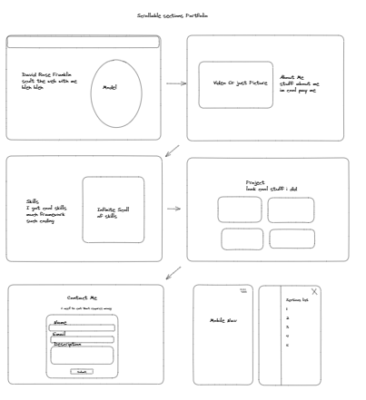

# My Portfolio

## Rough Draft Sketching

### Palettes

<div style="display: flex; gap: 10px;">
<div>
<div style="background-color: #F6F1F1; color: #212A3E; padding: 10px; border-top-left-radius: 15px; border-top-right-radius: 15px; width: 100px">
  Background
</div>
<div style="background-color: #C9EEFF; color: #212A3E; padding: 10px; width: 100px">
  Primary-1
</div>
<div style="background-color: #B0DAFF; color: #212A3E; padding: 10px; width: 100px">
  Primary-2
</div>
<div style="background-color: #6DA9E4; color: #212A3E; padding: 10px; border-bottom-left-radius: 15px; border-bottom-right-radius: 15px; width: 100px">
  Primary-3
</div>
</div>
<div>
<div style="background-color: #2B2B28; color: #ffffff; padding: 10px; border-top-left-radius: 15px; border-top-right-radius: 15px; width: 100px">
  Background
</div>
<div style="background-color: #595260; color: #ffffff; padding: 10px; width: 100px">
  Primary-1
</div>
<div style="background-color: #B2B1B9; color: #212A3E; padding: 10px; width: 100px">
  Primary-2
</div>
<div style="background-color: #EEEEEE; color: #212A3E; padding: 10px; border-bottom-left-radius: 15px; border-bottom-right-radius: 15px; width: 100px">
  Primary-3
</div>
</div>
</div>

### Libraries

(Keep it to a minimum no one like deps)

- Three JS
- Tailwindcss
- Next Core Libraries
- Mongoose
- React Youtube
- Nodemailer
- Next Auth

### Layout



### Logo

All the cool developers have a logo


This is a [Next.js](https://nextjs.org/) project bootstrapped with [`create-next-app`](https://github.com/vercel/next.js/tree/canary/packages/create-next-app).

## Getting Started

First, run the development server:

```bash
npm run dev
# or
yarn dev
# or
pnpm dev
```

Open [http://localhost:3000](http://localhost:3000) with your browser to see the result.

You can start editing the page by modifying `app/page.tsx`. The page auto-updates as you edit the file.

This project uses [`next/font`](https://nextjs.org/docs/basic-features/font-optimization) to automatically optimize and load Inter, a custom Google Font.

## Learn More

To learn more about Next.js, take a look at the following resources:

- [Next.js Documentation](https://nextjs.org/docs) - learn about Next.js features and API.
- [Learn Next.js](https://nextjs.org/learn) - an interactive Next.js tutorial.

You can check out [the Next.js GitHub repository](https://github.com/vercel/next.js/) - your feedback and contributions are welcome!

## Deploy on Vercel

The easiest way to deploy your Next.js app is to use the [Vercel Platform](https://vercel.com/new?utm_medium=default-template&filter=next.js&utm_source=create-next-app&utm_campaign=create-next-app-readme) from the creators of Next.js.

Check out our [Next.js deployment documentation](https://nextjs.org/docs/deployment) for more details.
